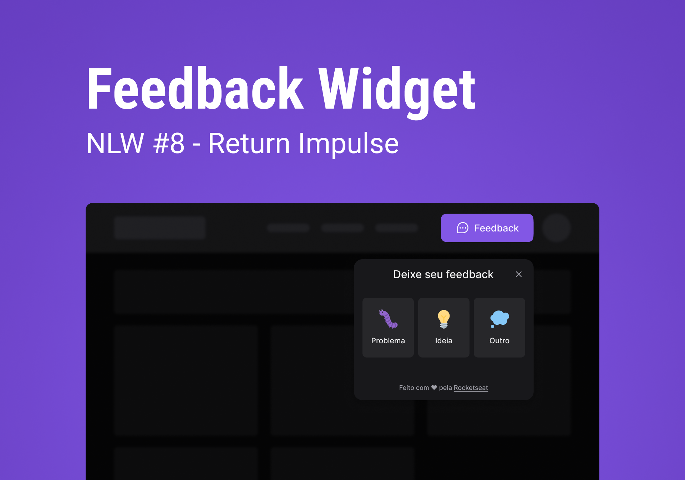

 

[LINK DO PROJETO NO VERCEL](https://nlw-return-impulse-mauve.vercel.app/)

 

  

## 🚀 Tecnologias

Esse projeto foi desenvolvido com as seguintes tecnologias:

WEB
- ReactJS
- TypeScript
- Vite
- Tailwind

Mobile
- React
- TypeScript
- Expo
 
Ferramentas
- [Vercel](https://vercel.com/)

## 💻 Projeto

Projeto realizado durante a trilha impulse do evento Next Level Week, realizado pela [Rocketseat](https://www.rocketseat.com.br/).

## 🔖 Layout
- [Rocketseat](https://www.rocketseat.com.br/)
- [Notion](https://efficient-sloth-d85.notion.site/Impulse-58f2daadb8e1433894420cbc57571087)
- [Layout](https://www.figma.com/community/file/1102912516166573468)

Desenvolvido por Leords.
